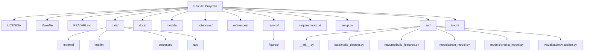

# Estimación del tiempo restante de explotación de yacimientos de turba en Tierra del Fuego mediante Aprendizaje Automático

**📚 Cátedra**: Aprendizaje Automático – 1C 2025  
**👨‍🏫 Docente**: Martín Mirabete  
**👨‍🎓 Alumno**: Sergio Andrés SÁNCHEZ  
**🏫 Establecimiento Educativo**: Centro Politécnico Superior MALVINAS ARGENTINAS  
**💼 Carrera**: Ciencias de Datos e Inteligencia Artificial

---

## 📁 Estructura de Directorios

## 🧾 Entrega Nº 1 – Descripción y Formulación del Objetivo

### 🌍 Contexto del problema

La extracción de turba en la provincia de Tierra del Fuego representa una actividad productiva clave, especialmente en zonas rurales. La turba es un recurso natural no renovable en escalas humanas de tiempo y su extracción está condicionada por factores climáticos, estacionales y económicos.

Con una estacionalidad marcada (más actividad en verano que en invierno), la explotación turbera requiere una planificación precisa para evitar la sobreexplotación y promover la sostenibilidad del recurso. Actualmente, las decisiones sobre tiempos de explotación se basan en cálculos aproximados o estimaciones estáticas. Un modelo predictivo que estime cuánto tiempo resta de explotación puede apoyar políticas públicas, decisiones empresariales y controles ambientales.

### Objetivos

#### Objetivo General

Desarrollar un modelo de Aprendizaje Automático que permita estimar el tiempo restante de explotación de un yacimiento de turba en Tierra del Fuego, promoviendo una gestión sostenible del recurso.

#### Objetivos Específicos

•	Realizar un análisis exploratorio de los datos registrados por el Ministerio de Producción y Ambiente.
•	Identificar variables relevantes que influyen en el ritmo de extracción y comercialización de turba.
•	Construir y evaluar modelos de regresión que estimen el tiempo restante de explotación.
•	Validar el desempeño del modelo utilizando métricas adecuadas.
•	Proponer una visualización comprensible del tiempo estimado para tomadores de decisiones.

### Problema de Aprendizaje Automático

Tipo: **Regresión**  
Variable objetivo: Tiempo restante estimado de explotación (meses/años/décadas)

El problema que se busca resolver es de regresión, ya que la variable objetivo será una estimación continua del tiempo (en meses, años o décadas) restante hasta que se agote el yacimiento, en función del volumen total estimado de turba y del ritmo de extracción y comercialización histórico.

### Variables clave

**Predictoras - Features**:

•	Superficie del yacimiento (ha)
•	Volumen total de turba a 2023
•	Tipo de mineral (turba negra o rubia)
•	Volumen extraído por año/mes/trimestre
•	Volumen comercializado
•	Año y mes de comercialización
•	Importe de regalías y tasas
•	Productor
•	Tasa de extracción anual promedio
•	Tasa de comercialización anual promedio

**Objetivo - Target**:

•	Tiempo restante estimado de explotación del yacimiento (en meses, años o décadas)

### Modelos de Aprendizaje Automático posibles

Dado que es un problema de regresión, se pueden considerar los siguientes modelos:

•	Regresión Lineal Múltiple: como línea base para comparar.
•	Árboles de Decisión para Regresión (DecisionTreeRegressor): útil si hay relaciones no lineales.
•	Random Forest Regressor: mejora del modelo anterior, reduce sobreajuste.
•	Gradient Boosting Regressor (como XGBoost o LightGBM): excelente rendimiento con grandes volúmenes de datos estructurados.
•	Redes Neuronales para regresión: si el volumen de datos lo permite.
•	K-Vecinos más Cercanos para regresión (KNN Regressor): útil si el patrón de extracción se asemeja a otros casos históricos.

### Relevancia del problema

Este proyecto aporta una solución tecnológica concreta a un problema ambiental y productivo. Estimar el tiempo de vida útil de un yacimiento permitirá mejorar:

•	La planificación de la producción.
•	La fiscalización del recurso.
•	El desarrollo de políticas sostenibles.
•	La toma de decisiones informada en actores públicos y privados.

---

## 📦 Entrega Nº 2 – Descripción del Dataset y Origen

### 🧮 Descripción del Dataset

- **Periodo cubierto**: enero 2020 – diciembre 2024
- **Tipo de turba**: Turba embolsada – *Musgus Sphagnum*  
- **Cantidad de instancias**: 1997  
- **Instancias en duda**: 23 (datos faltantes)  
- **Características**: 27 (2 categóricas, 25 numéricas)  

El Dataset provisto contempla expedientes tramitados por explotación de Turba Rubia y Negra por cada uno de los yacimientos desde enero de 2020 a diciembre de 2024.

Este Dataset tiene 1997 instancias de las cuales 23 instancias son las que están en duda y por eso se solicito una verificación / explicación de a que se refieren esas instancias en el Dataset, ya que en la mayoría de las características de la línea están sin información.

También se observó que no se tiene el listado de los yacimientos con la superficie total y lo restante por extraer como para poder comenzar con el trabajo del proyecto.

Este Dataset cuenta con 27 características, de las cuales 2 son de tipo categóricas y las restantes son de tipo numéricas. De las 2 de tipo categóricas, una solo posee el tipo de embalaje y nombre científico de la turba, que además es el único que se extrae (Turba embolsada - Musgus Sphagnum).

La otra característica categórica, refiere a si la extracción mencionada fue informada su comercialización o no.

### Las características que posee este Dataset son las siguientes:

| Variable               | Tipo       | Definición                                                                |
|------------------------|------------|---------------------------------------------------------------------------|
| Area                   | Numérica   | Superficie del yacimiento, en hectáreas                                   |
| Vol_N                  | Numérica   | Volumen de turba negra a 2023                                             |
| Vol_R                  | Numérica   | Volumen de turba rubia a 2023                                             |
| Vol_total              | Numérica   | Volumen total de turba a 2023                                             |
| Fecha                  | Numérica   | Año de cuantificación (2023)                                              |
| id                     | Numérica   | Valor de identificación (no tener en cuenta)                              |
| _uid_                  | Numérica   | Valor de identificación (no tener en cuenta)                              |
| poligono               | Numérica   | Número del polígono                                                       |
| id_2                   | Numérica   | Valor de identificación (no tener en cuenta)                              |
| producto               | Categórica | Tipo de mineral extraído                                                  |
| num_expte              | Numérica   | Número de expediente de regalías mineras                                  |
| ano                    | Numérica   | Año de declaración jurada                                                 |
| mes                    | Numérica   | Mes de declaración jurada                                                 |
| volumen_produccion     | Numérica   | Volumen de mineral extraído                                               |
| trimestre              | Numérica   | Trimestre de la declaración jurada                                        |
| regalias               | Numérica   | Importe de regalías mineras liquidado                                     |
| tasa_insp_fisc         | Numérica   | Importe de tasas de fiscalización liquidado                               |
| ano_comer              | Numérica   | Año de comercialización territorio nacional continental                   |
| mes_comer              | Numérica   | Mes de comercialización a territorio nacional continental                 |
| productor_comer        | Numérica   | Número de productor                                                       |
| producto_comer         | Numérica   | Producto comercializado                                                   |
| volumen_comercializado | Numérica   | Volumen comercializado                                                    |
| valor_fob_usd          | Numérica   | Valor FOB expresado en dólares (valor de mineral puesto en aduana)        |
| valor_fob_ars          | Numérica   | Valor FOB expresado en pesos (valor de mineral puesto en aduana)          |
| tasas_comercial        | Numérica   | Tasas abonadas en concepto de emisión de certificado exportación          |
| tasa_cambio            | Numérica   | Relación peso-dólar al momento de emitir el certificado de exportación    |
| sin_comercializacion   | Categórica | Valor TRUE (no comercializó) / FALSE (comercializó)                       |

Al parecer para anonimizar el Dataset, en id debería figurar el Identificador que ellos poseen del yacimiento sin mencionar cual es y por un error el mismo no salió en el Dataset.

En el transcurso de la semana del 02/06 al 06/06 se estaría solucionando el inconveniente.

Lamentablemente esto sucede por trabajar con información que no se tiene en Dataset ya armados y por eso estas demoras en poder hacer los análisis, pero con la idea y lo ventajoso de realmente estar trabajando con datos reales provenientes del gobierno y actualizados a la fecha.

> Notas:
> - Faltan IDs y datos de superficie total restantes por yacimiento.  
> - La información fue anonimizada.  
> - Se espera una versión corregida con esos datos para análisis completo.

### Informe sobre el origen del dataset, es decir, de dónde provienen los datos. Esto puede incluir la fuente, la fecha de adquisición y cualquier proceso de recopilación o preprocesamiento que haya realizado.

- **Fuente**: Base PostgreSQL de la Dirección General de Desarrollo Minero  
- **Institución**: Ministerio de Producción y Ambiente – Gobierno de Tierra del Fuego  
- **Fecha de entrega**: 16 de mayo de 2025  
- **Estado**: En proceso de verificación y mejora (semana 02/06 al 06/06)

Origen: El Dataset proviene de una base de datos en Postgre de la Dirección General de Desarrollo Minero dependiente del Ministerio de Producción y Ambiente del Gobierno de la Provincia de Tierra del Fuego, Antártida e Islas del Atlántico Su.

Fecha de disponibilidad del Dataset: Viernes 16 de mayo de 2025.

Recopilación y Preprocesamiento: Por el momento se realizó un análisis superficial de los datos y se encontró que hay datos faltantes en relación al tamaño total de cada yacimiento, por lo que se solicito al área que proveyó el Dataset proporcionar esa información faltante y se esta esperando que ese nuevo Dataset con la información solicitada pueda ser entregado para poder continuar con el análisis.
También estarían faltando los Id de cada uno de los yacimientos para así mantener anonimizado el Dataset. Este Id es el que una vez finalizado el análisis y el Modelo de Aprendizaje Automático, el mismo se pueda ceder al Minisiterio de Producción y Ambiente y puedan unir los datos a través de ese Id y así poder utilizar el Modelo de acá en más para diferentes análisis, así como poder ir ajustando el modelo si así se lo requiriese.