# Estimación del tiempo restante de explotación de yacimientos de turba en Tierra del Fuego mediante Aprendizaje Automático

**📚 Cátedra**: Aprendizaje Automático – 1C 2025  
**👨‍🏫 Docente**: Martín Mirabete  
**👨‍🎓 Alumno**: Sergio Andrés SÁNCHEZ  
**🏫 Establecimiento Educativo**: Centro Politécnico Superior MALVINAS ARGENTINAS  
**💼 Carrera**: Ciencias de Datos e Inteligencia Artificial

**VIDEO** de 7 minutos:

[Ver Video en GitHub - MP4 - Baja Calidad por limitación de peso de Github](video/PresentaciónTrabajo.pdf) 

[Ver Video en GitHub - MP4 - Alta Calidad en Drive](https://drive.google.com/file/d/1CbLYG5_sHMEyHkboVeIXzjxlJXvoNnMZ/view?usp=sharing)

[Ver Video en GitHub - MKV - Alta Calidad en Drive](https://drive.google.com/file/d/15-gFdl2sc2bQAL7JENJruKSkx8LE8gR1/view?usp=sharing)

---

## 📁 Estructura de Directorios

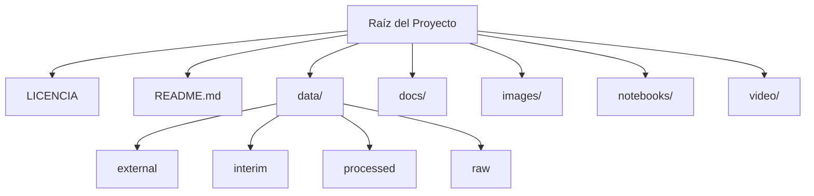
---

## 🧾 Abstract
[Ver PDF Abstract](docs/Abstract.pdf)

This study presents the development of a machine learning regression model aimed at estimating the remaining exploitation time of peat bogs in Tierra del Fuego. The dataset, which was provided by the Ministry of Production and Environment, includes records from 2020 to 2024 and contains variables such as extracted volume, commercialization data, and royalty payments. First, data preprocessing was necessary because key identifiers and total peat reserves were missing. A variety of regression models was tested, and Random Forest gave the most accurate results. The final model reached 96% accuracy, which could help public and private actors make better decisions. However, this performance might be limited because the model was trained on only five years of data. Although more historical data should be included, the current results are promising. The model’s predictions can be used for planning, oversight, and sustainability. Then, once site identifiers are restored, predictions may be linked back to actual peat bogs for practical use. This work demonstrates that real government data can support effective and responsible environmental management.

Este estudio presenta el desarrollo de un modelo de regresión basado en aprendizaje automático, destinado a estimar el tiempo restante de explotación de los yacimientos de turba en Tierra del Fuego. El conjunto de datos, que fue proporcionado por el Ministerio de Producción y Ambiente, incluye registros desde 2020 hasta 2024 y contiene variables como el volumen extraído, los datos de comercialización y el pago de regalías. Primero, fue necesario realizar un preprocesamiento de datos porque faltaban identificadores clave y la estimación total de reservas de turba. Se probaron diversos modelos de regresión, y Random Forest fue el que ofreció los resultados más precisos. El modelo final alcanzó una precisión del 96%, lo cual podría ayudar a actores públicos y privados a tomar mejores decisiones. Sin embargo, este rendimiento podría estar limitado porque el modelo fue entrenado con solo cinco años de datos. Aunque deberían incluirse más datos históricos, los resultados actuales son prometedores. Las predicciones del modelo pueden utilizarse para la planificación, el control y la sostenibilidad. Luego, una vez que se restauren los identificadores de sitio, las predicciones podrían vincularse a los yacimientos reales para su uso práctico. Este trabajo demuestra que los datos reales del gobierno pueden respaldar una gestión ambiental eficaz y responsable.

---

## 🧾 Entrega Nº 1 – Descripción y Formulación del Objetivo
[Ver PDF de la Entrega 1](docs/Entrega%201%20-%20Descripci%C3%B3n%20y%20Formulaci%C3%B3n%20del%20Objetivo.pdf)

### Contexto del problema

La extracción de turba en la provincia de Tierra del Fuego representa una actividad productiva clave, especialmente en zonas rurales. La turba es un recurso natural no renovable en escalas humanas de tiempo y su extracción está condicionada por factores climáticos, estacionales y económicos.

Con una estacionalidad marcada (más actividad en verano que en invierno), la explotación turbera requiere una planificación precisa para evitar la sobreexplotación y promover la sostenibilidad del recurso. Actualmente, las decisiones sobre tiempos de explotación se basan en cálculos aproximados o estimaciones estáticas. Un modelo predictivo que estime cuánto tiempo resta de explotación puede apoyar políticas públicas, decisiones empresariales y controles ambientales.

### Objetivos

#### Objetivo General

Desarrollar un modelo de Aprendizaje Automático que permita estimar el tiempo restante de explotación de un yacimiento de turba en Tierra del Fuego, promoviendo una gestión sostenible del recurso.

#### Objetivos Específicos

•	Realizar un análisis exploratorio de los datos registrados por el Ministerio de Producción y Ambiente.
•	Identificar variables relevantes que influyen en el ritmo de extracción y comercialización de turba.
•	Construir y evaluar modelos de regresión que estimen el tiempo restante de explotación.
•	Validar el desempeño del modelo utilizando métricas adecuadas.
•	Proponer una visualización comprensible del tiempo estimado para tomadores de decisiones.

### Problema de Aprendizaje Automático

Tipo: **Regresión**  
Variable objetivo: Tiempo restante estimado de explotación (meses/años/décadas)

El problema que se busca resolver es de regresión, ya que la variable objetivo será una estimación continua del tiempo (en meses, años o décadas) restante hasta que se agote el yacimiento, en función del volumen total estimado de turba y del ritmo de extracción y comercialización histórico.

### Variables clave

**Predictoras - Features**:

•	Superficie del yacimiento (ha)
•	Volumen total de turba a 2023
•	Tipo de mineral (turba negra o rubia)
•	Volumen extraído por año/mes/trimestre
•	Volumen comercializado
•	Año y mes de comercialización
•	Importe de regalías y tasas
•	Productor
•	Tasa de extracción anual promedio
•	Tasa de comercialización anual promedio

**Objetivo - Target**:

•	Tiempo restante estimado de explotación del yacimiento (en meses, años o décadas)

### Modelos de Aprendizaje Automático posibles

Dado que es un problema de regresión, se pueden considerar los siguientes modelos:

•	Regresión Lineal Múltiple: como línea base para comparar.
•	Árboles de Decisión para Regresión (DecisionTreeRegressor): útil si hay relaciones no lineales.
•	Random Forest Regressor: mejora del modelo anterior, reduce sobreajuste.
•	Gradient Boosting Regressor (como XGBoost o LightGBM): excelente rendimiento con grandes volúmenes de datos estructurados.
•	Redes Neuronales para regresión: si el volumen de datos lo permite.
•	K-Vecinos más Cercanos para regresión (KNN Regressor): útil si el patrón de extracción se asemeja a otros casos históricos.

### Relevancia del problema

Este proyecto aporta una solución tecnológica concreta a un problema ambiental y productivo. Estimar el tiempo de vida útil de un yacimiento permitirá mejorar:

•	La planificación de la producción.
•	La fiscalización del recurso.
•	El desarrollo de políticas sostenibles.
•	La toma de decisiones informada en actores públicos y privados.

---

## 🧾 Entrega Nº 2 – Descripción del Dataset y Origen
[Ver PDF de la Entrega 2](docs/Entrega%202%20-%20Descripci%C3%B3n%20del%20Dataset%20y%20Origen.pdf)

### Descripción del Dataset

- **Periodo cubierto**: enero 2020 – diciembre 2024
- **Tipo de turba**: Turba embolsada – *Musgus Sphagnum*  
- **Cantidad de instancias**: 1997  
- **Instancias en duda**: 23 (datos faltantes)  
- **Características**: 27 (2 categóricas, 25 numéricas)  

El Dataset provisto contempla expedientes tramitados por explotación de Turba Rubia y Negra por cada uno de los yacimientos desde enero de 2020 a diciembre de 2024.

Este Dataset tiene 1997 instancias de las cuales 23 instancias son las que están en duda y por eso se solicito una verificación / explicación de a que se refieren esas instancias en el Dataset, ya que en la mayoría de las características de la línea están sin información.

También se observó que no se tiene el listado de los yacimientos con la superficie total y lo restante por extraer como para poder comenzar con el trabajo del proyecto.

Este Dataset cuenta con 27 características, de las cuales 2 son de tipo categóricas y las restantes son de tipo numéricas. De las 2 de tipo categóricas, una solo posee el tipo de embalaje y nombre científico de la turba, que además es el único que se extrae (Turba embolsada - Musgus Sphagnum).

La otra característica categórica, refiere a si la extracción mencionada fue informada su comercialización o no.

### Las características que posee este Dataset son las siguientes:

| Variable               | Tipo       | Definición                                                                |
|------------------------|------------|---------------------------------------------------------------------------|
| Area                   | Numérica   | Superficie del yacimiento, en hectáreas                                   |
| Vol_N                  | Numérica   | Volumen de turba negra a 2023                                             |
| Vol_R                  | Numérica   | Volumen de turba rubia a 2023                                             |
| Vol_total              | Numérica   | Volumen total de turba a 2023                                             |
| Fecha                  | Numérica   | Año de cuantificación (2023)                                              |
| id                     | Numérica   | Valor de identificación (no tener en cuenta)                              |
| _uid_                  | Numérica   | Valor de identificación (no tener en cuenta)                              |
| poligono               | Numérica   | Número del polígono                                                       |
| id_2                   | Numérica   | Valor de identificación (no tener en cuenta)                              |
| producto               | Categórica | Tipo de mineral extraído                                                  |
| num_expte              | Numérica   | Número de expediente de regalías mineras                                  |
| ano                    | Numérica   | Año de declaración jurada                                                 |
| mes                    | Numérica   | Mes de declaración jurada                                                 |
| volumen_produccion     | Numérica   | Volumen de mineral extraído                                               |
| trimestre              | Numérica   | Trimestre de la declaración jurada                                        |
| regalias               | Numérica   | Importe de regalías mineras liquidado                                     |
| tasa_insp_fisc         | Numérica   | Importe de tasas de fiscalización liquidado                               |
| ano_comer              | Numérica   | Año de comercialización territorio nacional continental                   |
| mes_comer              | Numérica   | Mes de comercialización a territorio nacional continental                 |
| productor_comer        | Numérica   | Número de productor                                                       |
| producto_comer         | Numérica   | Producto comercializado                                                   |
| volumen_comercializado | Numérica   | Volumen comercializado                                                    |
| valor_fob_usd          | Numérica   | Valor FOB expresado en dólares (valor de mineral puesto en aduana)        |
| valor_fob_ars          | Numérica   | Valor FOB expresado en pesos (valor de mineral puesto en aduana)          |
| tasas_comercial        | Numérica   | Tasas abonadas en concepto de emisión de certificado exportación          |
| tasa_cambio            | Numérica   | Relación peso-dólar al momento de emitir el certificado de exportación    |
| sin_comercializacion   | Categórica | Valor TRUE (no comercializó) / FALSE (comercializó)                       |

Al parecer para anonimizar el Dataset, en id debería figurar el Identificador que ellos poseen del yacimiento sin mencionar cual es y por un error el mismo no salió en el Dataset.

En el transcurso de la semana del 02/06 al 06/06 se estaría solucionando el inconveniente.

Lamentablemente esto sucede por trabajar con información que no se tiene en Dataset ya armados y por eso estas demoras en poder hacer los análisis, pero con la idea y lo ventajoso de realmente estar trabajando con datos reales provenientes del gobierno y actualizados a la fecha.

> Notas:
> - Faltan IDs y datos de superficie total restantes por yacimiento.  
> - La información fue anonimizada.  
> - Se espera una versión corregida con esos datos para análisis completo.

### Informe sobre el origen del dataset, es decir, de dónde provienen los datos. Esto puede incluir la fuente, la fecha de adquisición y cualquier proceso de recopilación o preprocesamiento que haya realizado.

- **Fuente**: Base PostgreSQL de la Dirección General de Desarrollo Minero  
- **Institución**: Ministerio de Producción y Ambiente – Gobierno de Tierra del Fuego  
- **Fecha de entrega**: 16 de mayo de 2025  
- **Estado**: En proceso de verificación y mejora (semana 02/06 al 06/06)

Origen: El Dataset proviene de una base de datos en Postgre de la Dirección General de Desarrollo Minero dependiente del Ministerio de Producción y Ambiente del Gobierno de la Provincia de Tierra del Fuego, Antártida e Islas del Atlántico Su.

Fecha de disponibilidad del Dataset: Viernes 16 de mayo de 2025.

Recopilación y Preprocesamiento: Por el momento se realizó un análisis superficial de los datos y se encontró que hay datos faltantes en relación al tamaño total de cada yacimiento, por lo que se solicito al área que proveyó el Dataset proporcionar esa información faltante y se esta esperando que ese nuevo Dataset con la información solicitada pueda ser entregado para poder continuar con el análisis.
También estarían faltando los Id de cada uno de los yacimientos para así mantener anonimizado el Dataset. Este Id es el que una vez finalizado el análisis y el Modelo de Aprendizaje Automático, el mismo se pueda ceder al Minisiterio de Producción y Ambiente y puedan unir los datos a través de ese Id y así poder utilizar el Modelo de acá en más para diferentes análisis, así como poder ir ajustando el modelo si así se lo requiriese.

---

## 🧾 Entrega Nº 3 – Presentación del Modelo y Análisis de Resultados

[Ver PDF de la Entrega 3](docs/Entrega%203%20-%20Presentaci%C3%B3n%20del%20Modelo%20y%20An%C3%A1lisis%20de%20Resultados.pdf)

### Presentación de Objetivo del Proyecto

Desarrollar un modelo de Aprendizaje Automático que permita estimar el tiempo de vida restante de explotación de un yacimiento de turba en Tierra del Fuego, promoviendo una gestión sostenible del recurso.
El problema que se busca resolver es de regresión, ya que la variable objetivo será una estimación continua del tiempo (en meses, años o décadas) restante hasta que se agote el yacimiento, en función del volumen total estimado de turba y del ritmo de extracción y comercialización histórico.

#### Importancia y Relevancia del problema abordado

La extracción de turba en la provincia de Tierra del Fuego representa una actividad productiva clave, especialmente en zonas rurales. La turba es un recurso natural no renovable en escalas humanas de tiempo y su extracción está condicionada por factores climáticos, estacionales y económicos.
Con una estacionalidad marcada (más actividad en verano que en invierno), la explotación turbera requiere una planificación precisa para evitar la sobreexplotación y promover la sostenibilidad del recurso. Actualmente, las decisiones sobre tiempos de explotación se basan en cálculos aproximados o estimaciones estáticas. Un modelo predictivo que estime cuánto tiempo resta de explotación puede apoyar políticas públicas, decisiones empresariales y controles ambientales.

#### Descripción del Dataset

Origen: El Dataset proviene de una base de datos en Postgre de la Dirección General de Desarrollo Minero dependiente del Ministerio de Producción y Ambiente del Gobierno de la Provincia de Tierra del Fuego, Antártida e Islas del Atlántico Sur.

Fecha de disponibilidad del Dataset: Viernes 06 de junio de 2025 – Segunda Versión Dataset.
El Dataset provisto contempla expedientes tramitados por explotación de Turba Rubia y Negra por cada uno de los yacimientos desde enero de 2020 a diciembre de 2024.

Este Dataset cuenta con 1635 filas y 27 columnas con las siguientes características:

| Variable               | Tipo        | Definición                                                                 |
|------------------------|-------------|---------------------------------------------------------------------------|
| Area                  | Numérica    | Superficie del yacimiento, en hectáreas                                   |
| Vol_N                 | Numérica    | Volumen de turba negra a 2023                                             |
| Vol_R                 | Numérica    | Volumen de turba rubia a 2023                                             |
| Vol_total             | Numérica    | Volumen total de turba a 2023                                             |
| Fecha                 | Numérica    | Año de cuantificación (2023)                                              |
| id                    | Numérica    | valor de identificación (no tener en cuenta)                              |
| _uid_                 | Numérica    | valor de identificación (no tener en cuenta)                              |
| poligono              | Numérica    | número del polígono                                                       |
| id_2                  | Numérica    | valor de identificación (no tener en cuenta)                              |
| producto              | Categórica  | tipo de mineral extraído                                                  |
| num_expte             | Numérica    | número de expediente de regalías mineras                                  |
| ano                   | Numérica    | año de declaración jurada                                                 |
| mes                   | Numérica    | mes de declaración jurada                                                 |
| volumen_produccion    | Numérica    | volumen de mineral extraído                                               |
| trimestre             | Numérica    | trimestre de la declaración jurada                                        |
| regalias              | Numérica    | importe de regalías mineras liquidado                                     |
| tasa_insp_fisc        | Numérica    | importe de tasas de fiscalización liquidado                               |
| ano_comer             | Numérica    | año de comercialización territorio nacional continental                    |
| mes_comer             | Numérica    | mes de comercialización a territorio nacional continental                  |
| productor_comer       | Numérica    | número de productor                                                       |
| producto_comer        | Numérica    | producto comercializado                                                   |
| volumen_comercializado| Numérica    | volumen comercializado                                                    |
| valor_fob_usd         | Numérica    | valor FOB expresado en dólares (valor de mineral puesto en aduana)        |
| valor_fob_ars         | Numérica    | valor FOB expresado en pesos (valor de mineral puesto en aduana)          |
| tasas_comercial       | Numérica    | tasas abonadas por emisión de certificado de exportación                  |
| tasa_cambio           | Numérica    | relación peso/dólar al emitir el certificado de exportación               |
| sin_comercializacion  | Categórica  | valor TRUE (no comercializó) o FALSE (comercializó)

De este Dataset anonimizado, se estimará el tiempo de vida de cada uno de los yacimientos en base a saber su volumen total actual y las extracciones realizadas en los periodos que van desde Enero 2020 a Diciembre 2024 (5 años exactos)

Para el análisis a realizar, tendremos en cuenta solo aquellos yacimientos que han tenido producción en el periodo mencionado, es decir, que hayan tenido o estén en actividad informada.

#### Desarrollo del Modelo

Para este modelo se utilizó:

*	Algoritmo: Random Forest Regressor
*	Tipo de Modelo: Aprendizaje supervisado, Regresión
*	Variable Objetivo: meses_restantes_estimados (vida útil en meses)
*	Variable predictora principal: extraccion_prom_mensual (media móvil de extracción de los últimos 6 meses).
*	Transformación aplicada: Log-transformación de la variable objetivo para estabilizar la varianza y mejorar la distribución.

#### Hiperparámetros utilizados:

* n_estimators = 100: número de árboles en el bosque.
* random_state = 42: para reproducibilidad.

Se utilizó el valor por defecto de max_depth para permitir que cada árbol crezca libremente, maximizando el ajuste local.

#### Métricas utilizadas para evaluar el modelo:

* **MAE** (Error Absoluto Medio)
* **RMSE** (Raíz del Error Cuadrático Medio)
* **R2** (Coeficiente de Determinación)

#### Análisis de resultados:

#### Análisis Exploratorio de datos:

*	Se tienen 1635 filas y 27 columnas.
*	Se descartan 19 Columnas que no son de utilidad para nuestro análisis, siendo estas las siguientes:
*	"Fecha", "id", "_uid_", "id_2", "producto", "num_expte", "trimestre", "regalias", "tasa_insp_fisc", "ano_comer", "mes_comer", "productor_comer", "producto_comer", "volumen_comercializado", "valor_fob_usd", "valor_fob_ars", "tasas_comercial", "tasa_cambio" y "sin_comercializacion".
*	Lo que nos lleva a quedarnos con 8 columnas:
*	“Area”, “Vol_N”, “Vol_R”, “Vol_Total”, “polígono”, “ano”, “mes” y “volumen_producción”
*	Del resultado restante se procede a eliminar las filas donde polígono es 0 o NaN, lo que nos lleva a eliminar 11 filas, quedándome 1624 filas.
*	Luego se convierten las columnas “Area”, “Vol_N”, “Vol_R”, “Vol_Total” y “volumen_producción” a tipo Float , las columnas “poligono2, “ano” y “mes” a tipo entero (int64) y creo la columna “fecha” de tipo periodo con los datos de “ano” y “mes”.
*	A posterior se eliminan las filas en las que “volumen_producción” = 0, ya que si no produjeron no serán tenidas en cuenta para el modelo. Se eliminan 1120 Filas.
*	Todo este proceso lleva a quedarme con 504 Filas y 10 Columnas.
*	Ya con la reducción del Dataset, procedo a evaluar los Outliers. Lo que me da que tengo Outliers que procedo a eliminar.
*	Luego agrupo por “polígonos” y “ano_mes”.
*	Calculo la extracción acumulada "volumen_acumulado", el "volumen_restante" y "extraccion_prom_mensual" y estimo los meses restantes.
*	A este momento tengo 447 Filas y 11 Columnas.

#### Contruyo el Modelo - RandomForestRegressor

*	Al Modelo lo creo sin los "meses_restantes_estimados" y "extraccion_prom_mensual" que tengan NaN, ya que tampoco me serán de utilidad.
*	Divido en Entrenamiento 80% y prueba 20%.
*	Confirmo que no tenga nulos.
*	Entreno el modelo con RandomForestRegressor.
*	Hago la Predicción.
*	Evaluo MAE, RMSE y R2 y obtengo:
    o	MAE: 837.0908775674981
    o	RMSE: 3840.657154548537
    o	R2 Score: 0.9596689800910517

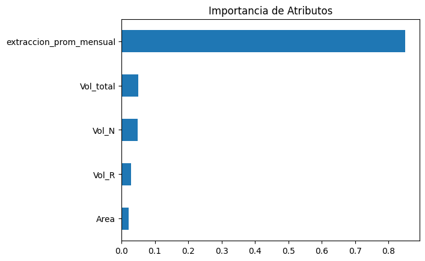

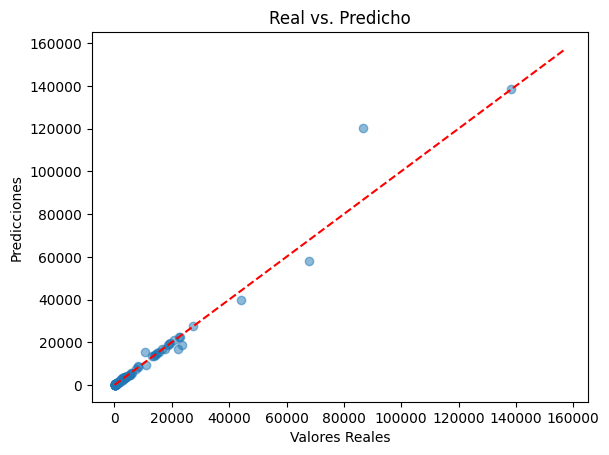

*	Se puede observar que salvo algunos puntos el modelo se ajusta muy bien a la predicción, por eso el R2 es de casí un 96%.
*	Analizo los polígonos extremos.
*	Observo que los polígonos con más datos son: [209, 2, 204, 8, 17]
*	Visualizo el impacto:

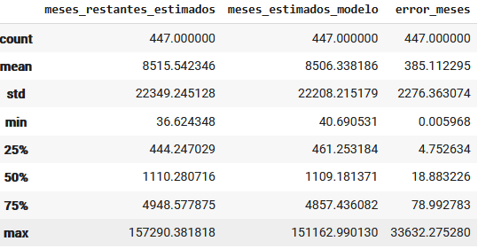

*	Obtengo la tabla de resumen de polígonos:

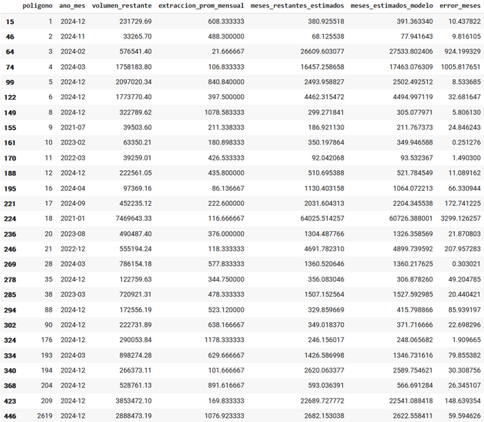
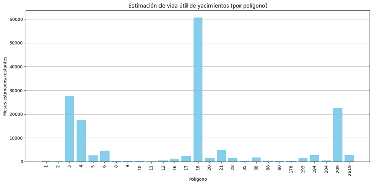
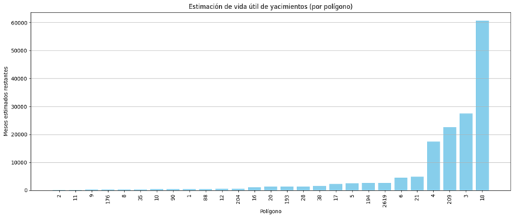
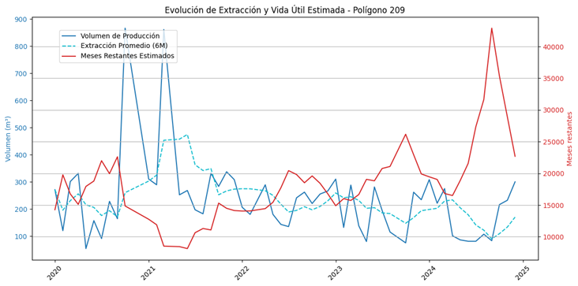

En este gráfico se puede observar como cuando la producción (línea azul continua) se ve incrementada, el tiempo de meses restantes estimados baja, dando a entender que el yacimiento se terminará antes.

También podemos observar en una línea punteada celeste el promedio mensual de extracción de los últimos 6 meses.

Saco unas estadísticas de la variable objetivo "meses_restantes_estimados"

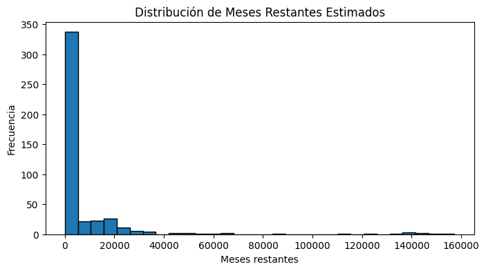

Genero un Box-Plot de la variable objetivo

Y observo que existen outliers, por lo que procedo a sacar medidas y eliminar los innecesarios (83), lo que me deja con 364 Filas sin los outliers.

#### Contruyo el Modelo de Transformación Logarítmica

Para intentar mejorar el modelo Genero un modelo de Transformación Logarítmica y vuelvo a calcular MAE, RMSE y R2, obteniendo:

*	MAE después de log-transform & back-transform: 710.9698775230927
*	RMSE después de log-transform & back-transform: 1432.9253672516036
*	R² para predicción log-transformada y revertida: 0.5681

Y vuelvo a generar la tabla por polígonos:

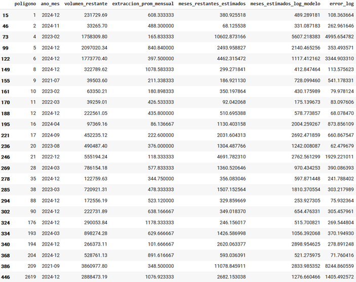

En la cual no solo tengo 2 polígonos menos (3 y 18), sino que los valores si bien parecen mejorar tanto en MAE como en RMSE, el R2 empeoró muchísimo.

Y al realizar una comparativa del MAE por rango de meses obtengo:

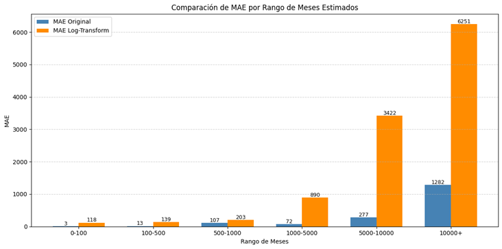

En este gráfico se puede observar para concluir que:

*	Para los rangos bajos (0-100, 100-500, etc.), el modelo original tiene errores mucho menores que el modelo log-transformado.
*	A medida que aumenta el rango, especialmente desde los 1000 meses en adelante, el modelo log-transformado comienza a producir errores mucho mayores.

El Modelo de Transformación Logarítmica puede suavizar la influencia de valores extremos en el entrenamiento, pero al revertirla puede amplificar los errores en las predicciones grandes. Esto sugiere que el modelo original está mejor calibrado para todo el rango, especialmente para valores grandes, mientras que el log-transformado puede no estar capturando correctamente la magnitud de las predicciones en rangos altos.

#### Conclusión final

El modelo de Random Forest Regressor sin transformación logarítmica fue el que presentó el mejor rendimiento global, con un R² de 0.96, lo que indica una excelente capacidad explicativa de la variabilidad de los datos. Además, mostró un error absoluto medio (MAE) de aproximadamente 837 meses y un RMSE de 3840, valores coherentes con la escala y dispersión de la variable objetivo.

Por otro lado, el modelo con transformación logarítmica logró un MAE más bajo (711) y una notable reducción del RMSE (1432), pero a costa de una fuerte caída en el R² (0.57). Esta baja en el poder explicativo, sumada al análisis por rangos de meses restantes, donde el modelo original superó consistentemente al transformado, refuerza la decisión de mantener el modelo sin logaritmo como el más confiable.

Sin embargo, es importante remarcar que el dataset cuenta con solo cinco años de información histórica (Enero 2020 a Diciembre 2024), lo cual resulta escaso frente a estimaciones que se expresan en escalas de cientos o incluso miles de meses. Esta limitación temporal reduce la capacidad del modelo para aprender patrones a largo plazo y afecta su fiabilidad cuando proyecta escenarios muy alejados en el tiempo.

A pesar de la mejora en algunos indicadores puntuales, la transformación logarítmica no aportó beneficios generalizados al rendimiento del modelo. El modelo original de Random Forest, sin transformación, es el más robusto y balanceado para estimar la vida útil restante de los yacimientos de turba. No obstante, debe considerarse que la brevedad del histórico disponible condiciona la precisión de las estimaciones, especialmente en horizontes temporales largos.

---